# Data Science & Artifical Intelligence with Python

In this repo you can find useful examples of Data Science use cases and Artificial Intelligence problems.\
Most of the projects are documented on [*Medium*](https://maurodp.medium.com/).

 

### 1. Machine Learning:
- <ins>**[Classification](https://github.com/mdipietro09/DataScience_ArtificialIntelligence_Utils/blob/master/machine_learning/example_classification.ipynb)**</ins>
 
	
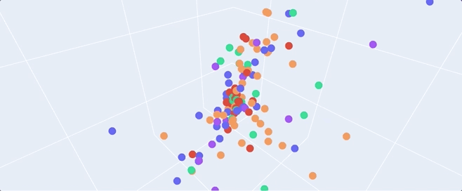

 

- <ins>**[Regression](https://github.com/mdipietro09/DataScience_ArtificialIntelligence_Utils/blob/master/machine_learning/example_regression.ipynb)**</ins>
 	
	
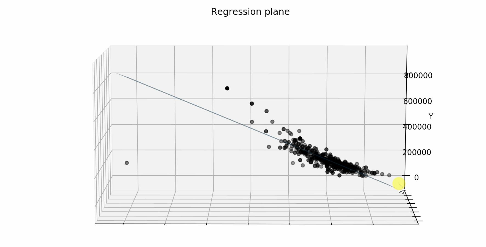

 

- <ins>**[Clustering](https://github.com/mdipietro09/DataScience_ArtificialIntelligence_Utils/blob/master/machine_learning/example_clustering.ipynb)**</ins>
 
	
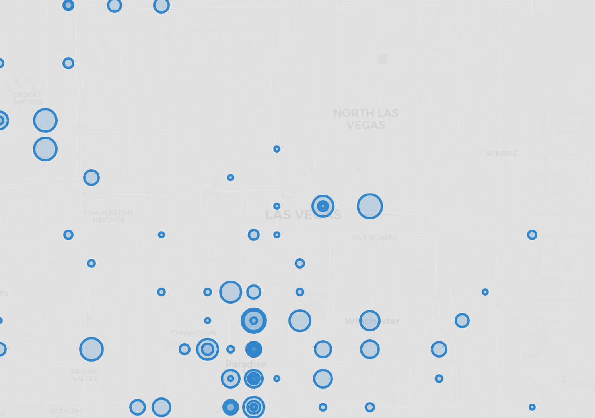

 

- <ins>**[Recommendation Systems](https://github.com/mdipietro09/DataScience_ArtificialIntelligence_Utils/blob/master/machine_learning/example_recommendation.ipynb)**</ins>
 
	
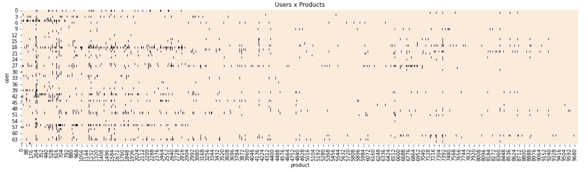

 

- <ins>**[Route Optimization](https://github.com/mdipietro09/DataScience_ArtificialIntelligence_Utils/blob/master/machine_learning/example_route_optimization.ipynb)**</ins>
 
	
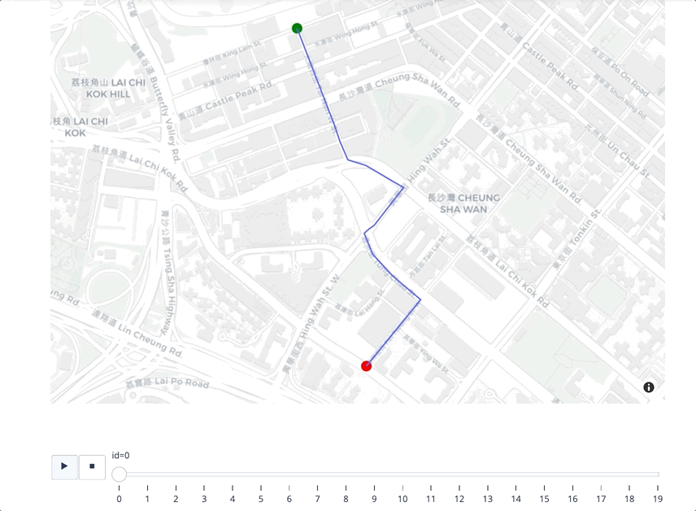

 

------

### 2. Time Series:
- <ins>**[Forecasting](https://github.com/mdipietro09/DataScience_ArtificialIntelligence_Utils/blob/master/time_series/example_forecast.ipynb)**</ins>
 
	
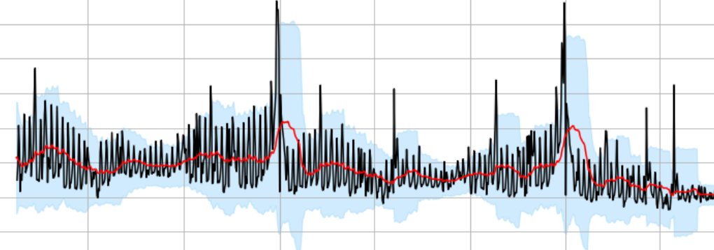

 

- <ins>**[Parametric Fit](https://github.com/mdipietro09/DataScience_ArtificialIntelligence_Utils/blob/master/time_series/example_parametric_fit.ipynb)**</ins>
 
	
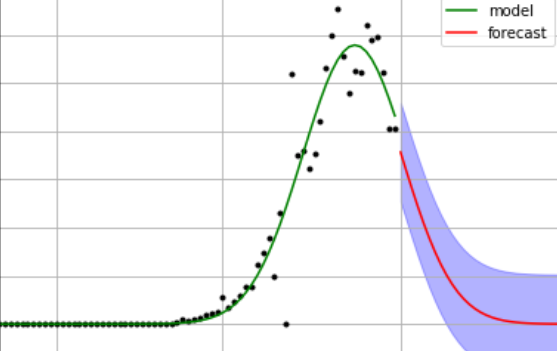

 

- <ins>**[Multi Series](https://github.com/mdipietro09/DataScience_ArtificialIntelligence_Utils/blob/master/time_series/example_clustering.ipynb)**</ins>
 
	
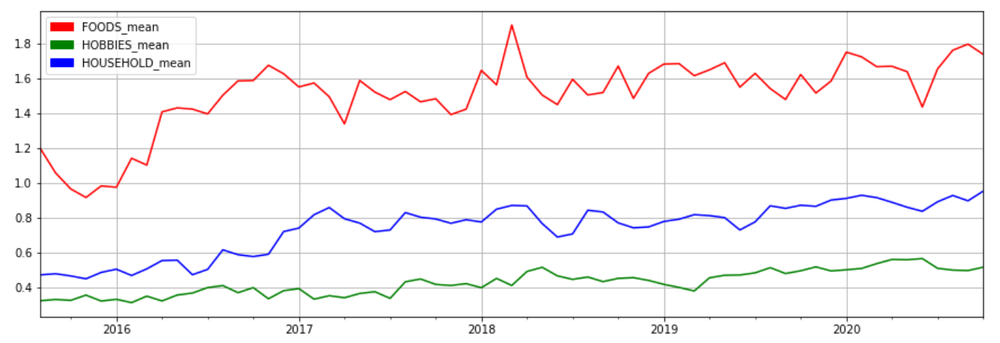

 

------

### 3. Natural Language Processing:
- <ins>**[Text Classification](https://github.com/mdipietro09/DataScience_ArtificialIntelligence_Utils/blob/master/natural_language_processing/example_text_classification.ipynb)**</ins>
 
	

 

- <ins>**[Text Summarization](https://github.com/mdipietro09/DataScience_ArtificialIntelligence_Utils/blob/master/natural_language_processing/example_text_summarization.ipynb)**</ins>
 
	

 

- <ins>**[Knowledge Graph](https://github.com/mdipietro09/DataScience_ArtificialIntelligence_Utils/blob/master/natural_language_processing/example_knowledge_graph.ipynb)**</ins>
 
	
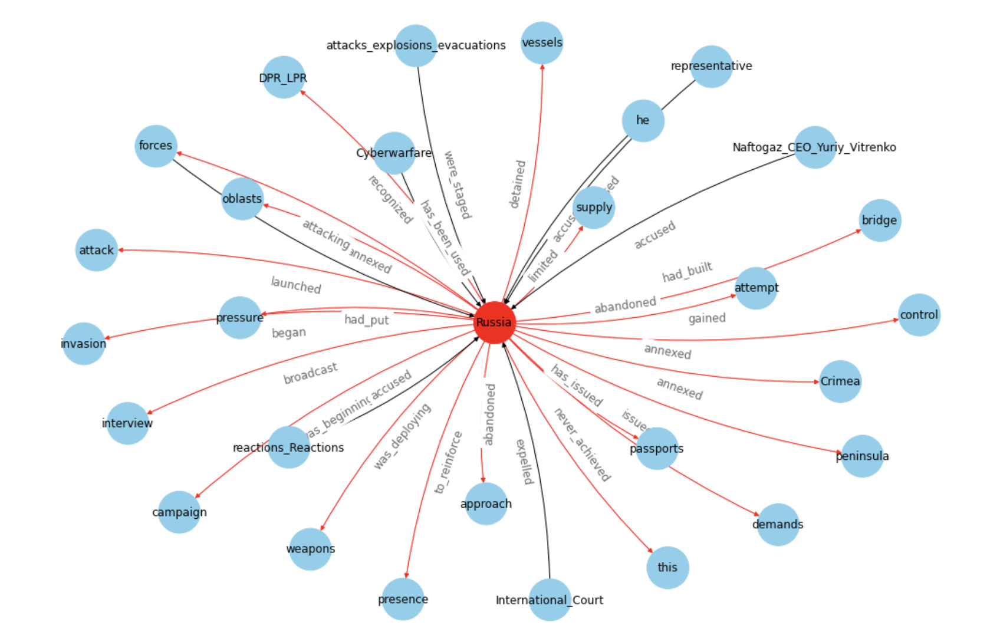

 

------

### 4. Computer Vision:
- <ins>**[Image Classification](https://github.com/mdipietro09/DataScience_ArtificialIntelligence_Utils/blob/master/computer_vision/example_img_classification.ipynb)**</ins>
 
	
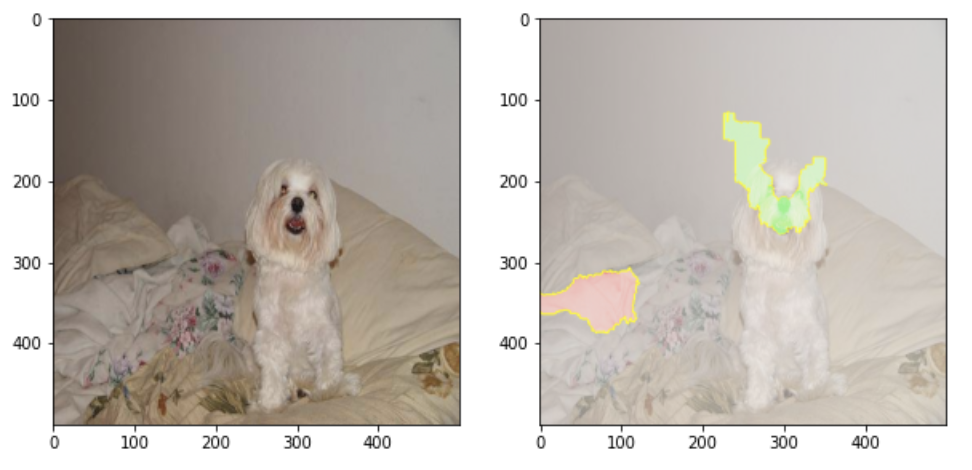

 

- <ins>**[Object Detection](https://github.com/mdipietro09/DataScience_ArtificialIntelligence_Utils/blob/master/computer_vision/example_obj_detection.ipynb)**</ins>
 
	

 

- <ins>**[OCR Parsing](https://github.com/mdipietro09/DataScience_ArtificialIntelligence_Utils/blob/master/computer_vision/example_ocr_parsing.ipynb)**</ins>
 
	
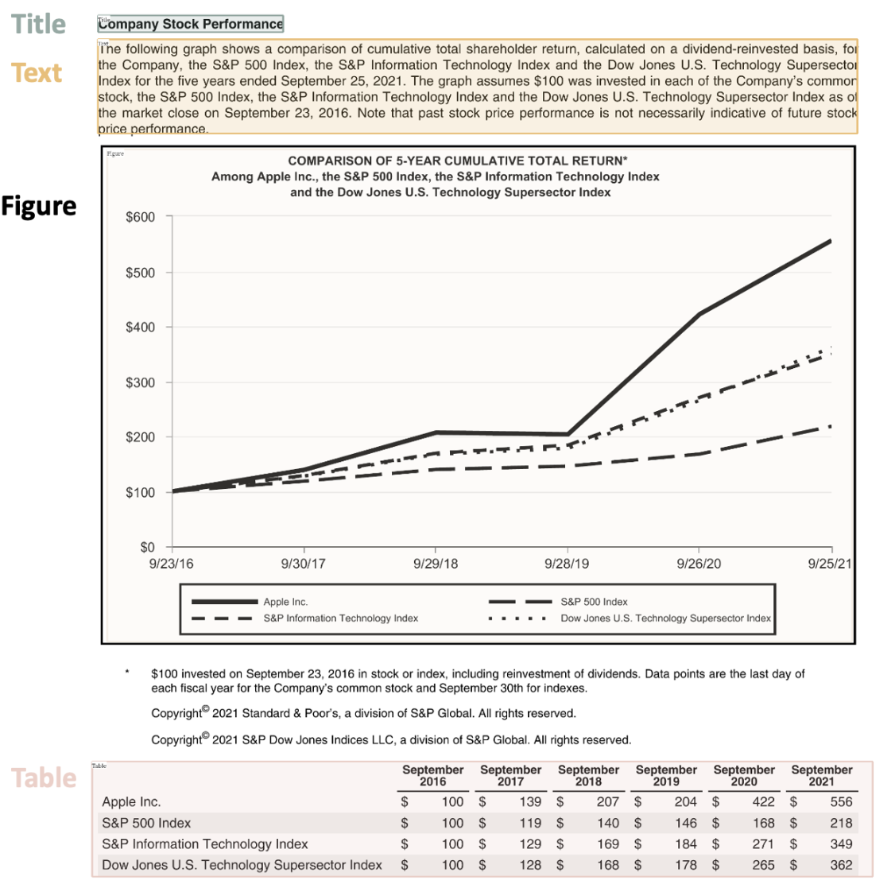

 

------

### 5. Reinforcement Learning:
- <ins>**[Artificial Intelligence Agent](https://github.com/mdipietro09/DataScience_ArtificialIntelligence_Utils/blob/master/reinforcement_learning/example_ai_agent.ipynb)**</ins>
	* work in progress