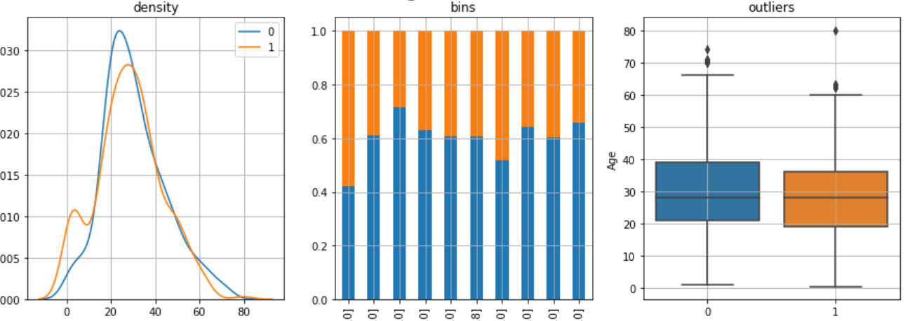
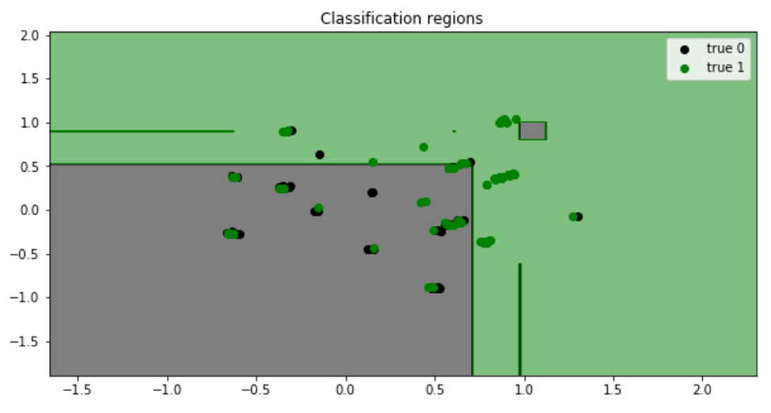
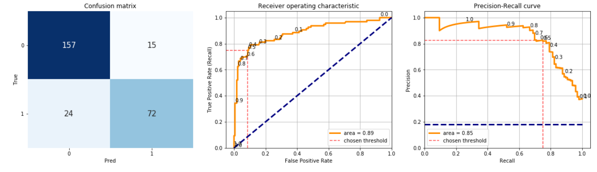
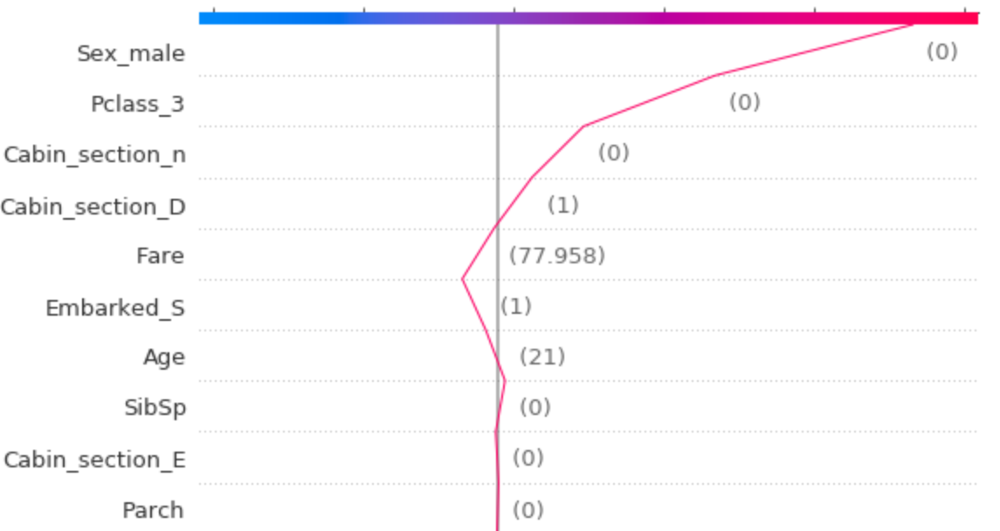
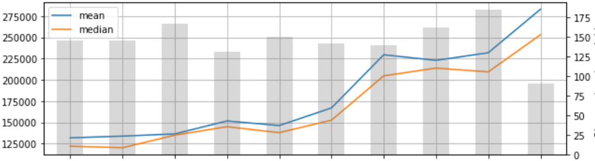
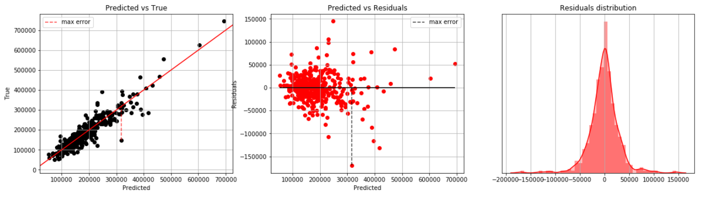
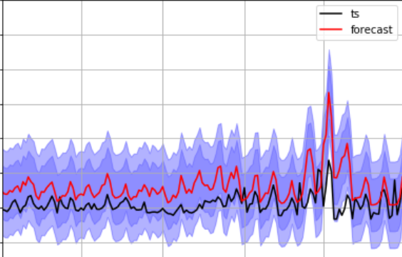
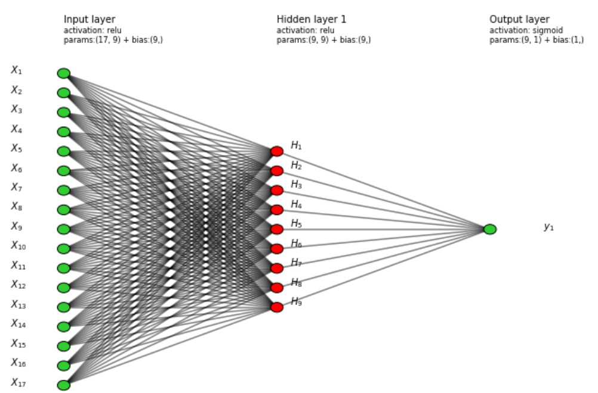
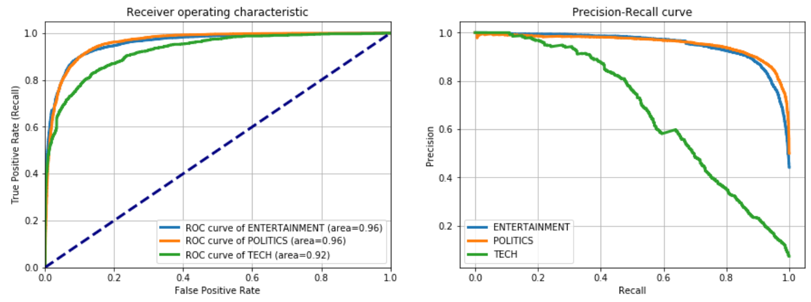
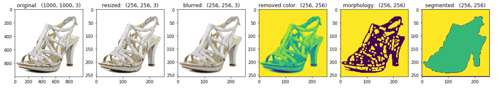

# Data Science & Artifical Intelligence utils functions in Python

In this repo you can find useful examples of Data Science use cases and Artificial Intelligence problems.\
Some of these examples are explained in articles on *Towards Data Science* and *Analytics Vidhya*, 
links are in the notebooks or you can check [here](https://medium.com/@m.dipietro09).

### 1. Classic Machine Learning:
- <ins>**[Classification](https://github.com/mdipietro09/DataScience_ArtificialIntelligence_Utils/blob/master/machine_learning/example_classification.ipynb)**</ins>
	* Analysis 

		
	
	* Model 

		
	
	* Evaluation 

		

	* Explainability 

		

- <ins>**[Regression](https://github.com/mdipietro09/DataScience_ArtificialIntelligence_Utils/blob/master/machine_learning/example_regression.ipynb)**</ins>
	* Analysis
		
		
	
	* Model
		
		
	
	* Evaluation
	
		

	* Explainability 

		

------

### 2. Time Series:
- <ins>**[Forecsting](https://github.com/mdipietro09/DataScience_ArtificialIntelligence_Utils/blob/master/time_series/example_forecast.ipynb)**</ins>
	* Analysis
	
		
	
	* Model
		
		
	
	* Evaluation
		
		

- <ins>**[Parametric fit](https://github.com/mdipietro09/DataScience_ArtificialIntelligence_Utils/blob/master/time_series/example_parametric_fit.ipynb)**</ins>
	* Model

		

------

### 3. Natural Language Processing:
- <ins>**[Text classification](https://github.com/mdipietro09/DataScience_ArtificialIntelligence_Utils/blob/master/deep_learning_natural_language_processing/example_text_classification.ipynb)**</ins>
	* Analysis
		
		

	* Model
		
		

	* Evaluation
		
		

	* Explainability 

		

------

### 4. Computer Vision:
- <ins>**[Image detection and classification](https://github.com/mdipietro09/DataScience_ArtificialIntelligence_Utils/blob/master/deep_learning_computer_vision/example_detection_and_classification.ipynb)**</ins>
	* Preprocessing

		

	* Object detection

		

------

### 5. Reinforcement Learning:
- <ins>**[Artificial Intelligence agent](https://github.com/mdipietro09/DataScience_ArtificialIntelligence_Utils/blob/master/reinforcement_learning/example_artificial_intelligence.ipynb)**</ins>
	* work in progress