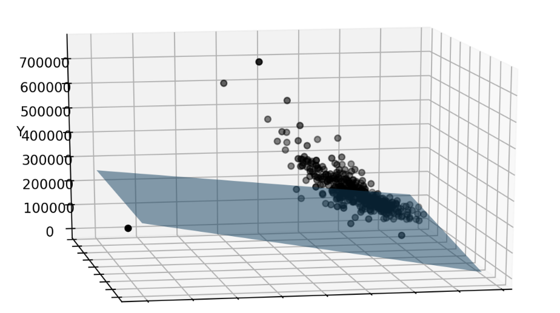
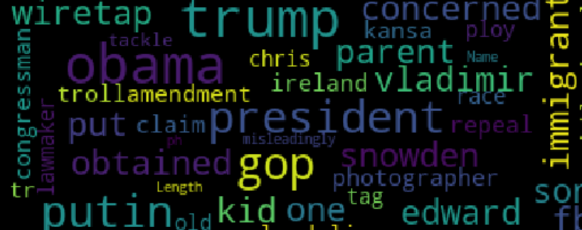

# Data Science & Artifical Intelligence utils functions in Python

In this repo you can find useful examples of Data Science use cases and Artificial Intelligence problems.
Some of these examples are explained in articles on Towards Data Science and Analytics Vidhya, links are in the notebooks or you can check [here](https://medium.com/@m.dipietro09).

### Repo structure:

###### 1. Classic Machine Learning:
- Regression on structured data
	* Analysis
		
	* Model
		
	* Evaluation
		

- Classification on structured data
	* Analysis
		
	* Model
		
	* Evaluation
		

###### 2. Time Series:
- Forecsting
	* Analysis
		
	* Model
		
	* Evaluation
		

- Parametric fit
		

###### 3. Natural Language Processing:
- Text classification
	* Analysis
		
	* Model
		
	* Evaluation
		

###### 4. Computer Vision:
- Image detection and classification
	* Analysis

###### 5. Reinforcement Learning:
- Artificial Intelligence agent
	* work in progress