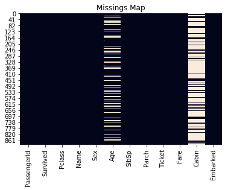
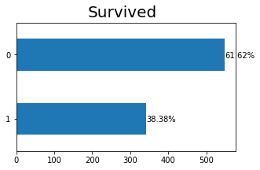
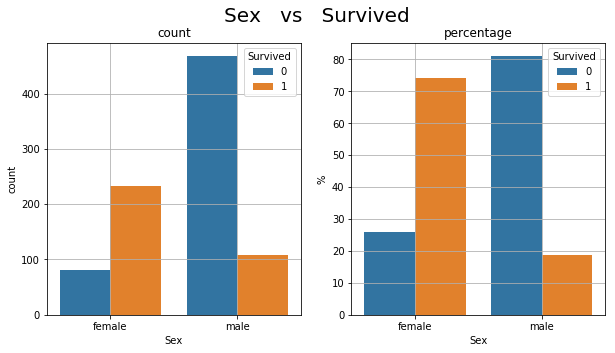
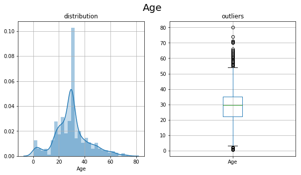
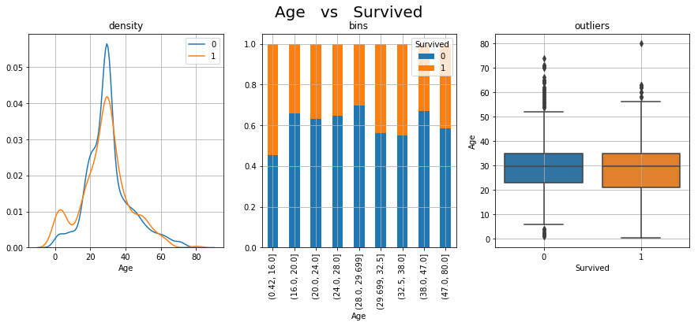
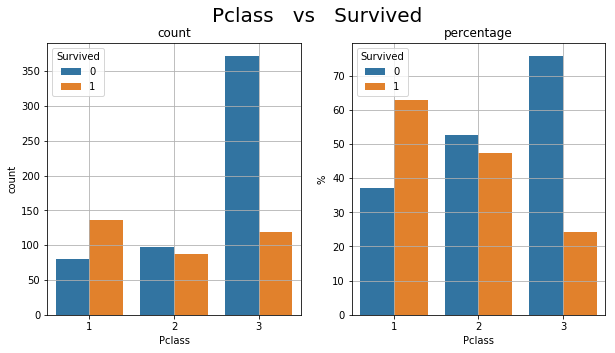
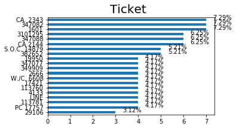
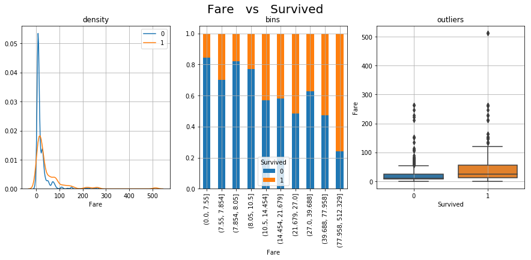

```python

```


```python
from ml_utils import *
```


```python

```


```python
dtf = pd.read_csv('http://bit.ly/kaggletrain')
dtf.head()
```


<div>
<style scoped>
    .dataframe tbody tr th:only-of-type {
        vertical-align: middle;
    }

    .dataframe tbody tr th {
        vertical-align: top;
    }

    .dataframe thead th {
        text-align: right;
    }
</style>
<table border="1" class="dataframe">
  <thead>
    <tr style="text-align: right;">
      <th></th>
      <th>PassengerId</th>
      <th>Survived</th>
      <th>Pclass</th>
      <th>Name</th>
      <th>Sex</th>
      <th>Age</th>
      <th>SibSp</th>
      <th>Parch</th>
      <th>Ticket</th>
      <th>Fare</th>
      <th>Cabin</th>
      <th>Embarked</th>
    </tr>
  </thead>
  <tbody>
    <tr>
      <th>0</th>
      <td>1</td>
      <td>0</td>
      <td>3</td>
      <td>Braund, Mr. Owen Harris</td>
      <td>male</td>
      <td>22.0</td>
      <td>1</td>
      <td>0</td>
      <td>A/5 21171</td>
      <td>7.2500</td>
      <td>NaN</td>
      <td>S</td>
    </tr>
    <tr>
      <th>1</th>
      <td>2</td>
      <td>1</td>
      <td>1</td>
      <td>Cumings, Mrs. John Bradley (Florence Briggs Th...</td>
      <td>female</td>
      <td>38.0</td>
      <td>1</td>
      <td>0</td>
      <td>PC 17599</td>
      <td>71.2833</td>
      <td>C85</td>
      <td>C</td>
    </tr>
    <tr>
      <th>2</th>
      <td>3</td>
      <td>1</td>
      <td>3</td>
      <td>Heikkinen, Miss. Laina</td>
      <td>female</td>
      <td>26.0</td>
      <td>0</td>
      <td>0</td>
      <td>STON/O2. 3101282</td>
      <td>7.9250</td>
      <td>NaN</td>
      <td>S</td>
    </tr>
    <tr>
      <th>3</th>
      <td>4</td>
      <td>1</td>
      <td>1</td>
      <td>Futrelle, Mrs. Jacques Heath (Lily May Peel)</td>
      <td>female</td>
      <td>35.0</td>
      <td>1</td>
      <td>0</td>
      <td>113803</td>
      <td>53.1000</td>
      <td>C123</td>
      <td>S</td>
    </tr>
    <tr>
      <th>4</th>
      <td>5</td>
      <td>0</td>
      <td>3</td>
      <td>Allen, Mr. William Henry</td>
      <td>male</td>
      <td>35.0</td>
      <td>0</td>
      <td>0</td>
      <td>373450</td>
      <td>8.0500</td>
      <td>NaN</td>
      <td>S</td>
    </tr>
  </tbody>
</table>
</div>


```python
check_Nas(dtf, plot="map")
```

    len dtf: 891
    PassengerId --> Nas: 0 (0.0%)
        # possible pk
    Survived --> Nas: 0 (0.0%)
    Pclass --> Nas: 0 (0.0%)
    Name --> Nas: 0 (0.0%)
        # possible pk
    Sex --> Nas: 0 (0.0%)
    Age --> Nas: 177 (19.900000000000002%)
    SibSp --> Nas: 0 (0.0%)
    Parch --> Nas: 0 (0.0%)
    Ticket --> Nas: 0 (0.0%)
    Fare --> Nas: 0 (0.0%)
    Cabin --> Nas: 687 (77.10000000000001%)
    Embarked --> Nas: 2 (0.2%)
    





```python

```


```python
freqdist_plot(dtf, "Survived", figsize=(5,3))
```





```python

```


```python

```

###### rr
- pk: PassengerId, Name
- y: Survived
- who: Sex, Age
- wealth: Pclass, Ticket, Fare
- where: Parch, Cabin, Embarked
- how many: SibSp 


```python

```


```python
bivariate_plot(dtf, x="Sex", y="Survived", figsize=(10,5))
```





```python
dtf["Age"].mean()
```


    29.69911764705882


```python
dtf["Age"] = dtf["Age"].fillna( dtf["Age"].mean() )
```


```python
freqdist_plot(dtf, "Age", figsize=(10,5))
```





```python
bivariate_plot(dtf, x="Age", y="Survived", figsize=(15,5))
```





```python
bivariate_plot(dtf, x="Pclass", y="Survived", figsize=(10,5))
```





```python
freqdist_plot(dtf, "Ticket", figsize=(5,3))
```





```python
bivariate_plot(dtf, x="Fare", y="Survived", figsize=(15,5))
```





```python
bivariate_plot(dtf, x="Fare", y="Survived", figsize=(15,5))
```
